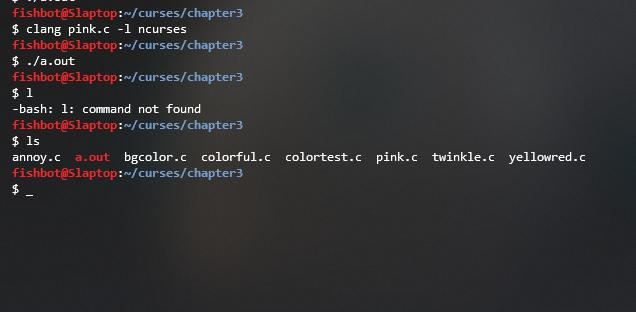

# Dan Gookin's Guide to Ncurses Programming
We got a [book](https://c-for-dummies.com/ncurses/) about ncurses and we're coding along.

__<a>[terminal text attribute test](./chapter4/attrtest.c)</a>__

## <a>Hello World!</a> 

[glub.c](./glub/glub.c)
- we don't 'hello world,' we 'glub... glub...'
- (Dan Gookin doesn't 'hello world' either apparently, the book does a 'Goodbye, cruel world!' then a 'Goodbye, cruel C programming!')

```bash
cd glub
clang glub.c -l ncurses
./a.out
```

## <a>Notes</a> 

### <a>Chapter 3</a> 

- [twinkle.c](./chapter3/twinkle.c)
    - text attribute A_BLINK doesn't seem to do anything when set 
    - the book mentions that this gets turned off in some terminals (pg. 20)

    ```C
    attron(A_BLINK);
    ```
- [pink.c](./chapter3/pink.c)
    - passes the can_color_change() condition fine, but only seems to set the color to red...

    ```C
    int main(){
        //...
        init_color(PINK, 0, 0, 1000);
        init_color(PINK, 0, 1000, 0);
        init_color(PINK, 1000, 0, 0);
        // these all make the same color?
    }

    ```
    - "In Line 13, the _init\_color_ fucnction assigns a new color to constant PINK, which is color 1 (originally red)" (pg. 28)
    - So we can't change color and we're not failing the can_change_color() check apparently. Neat...

    ```C
    int main(){
        //...
        init_color(PINK, 0, 1000, 0);  //this for some reason replaces green with red in the terminal when we exit the window
        init_pair(1, PINK, COLOR_BLACK);
        attrset(COLOR_PAIR(1));
        printw("This is the new color %d.\n", PINK);
    }
    ```

    

    - Could init_color functionality may have changed since the writing of this book. This is something we should look into ***
    - Instead of assigning a new color, it seems to overwrite the terminal color, but not in the way I'd expect. 
    - This could also be fluent terminal strangeness, we should test other terminals (with and without themes)


- [notice.c](./chapter3/notice.c)

    - no beep or flash on fluent terminal (this may be a fluent setting I turned off)

__<a>\*</a> notice.c and twinkle.c work properly on xterm in linux, but the can_change_color() condition fails (tested with xserver on Arch)__ 

__<a>ALTCHARSET table [pg. 39](https://c-for-dummies.com/ncurses/tables/table04-03.php)</a>__


### <a>Chapter 4</a>

> [Errata](https://c-for-dummies.com/ncurses/#errata) In Chapter 4, the section on Unicode should recommend that the ncursesw library may be required in place of ncurses. Use the switch -lncursesw on the command line. Ensure that you have the libncursesw5-dev library installed; use your distro's package manager. (Thanks to reader Matt, 2021-01-15.)

- [unicode.c](./chapter4/unicode.c)
    - works in WSL but not in xterm (Arch or Xserver likely need some extra configuration to turn unicode on)
    - needs to be compiled with ncursesw

- [ustring.c](./chapter4/ustring.c)
    - _"If you don't see the text output in Cyygwin, change the font to Lucinda Console or some other font that suports Unicode text." (pg.48)_


### <a>Chapter 8</a> 

pg. 80

    Though the getnstr() function does cap input, its up to you to ensure that the value of n is less than the buffer size. Otherwise input overflow occurs.